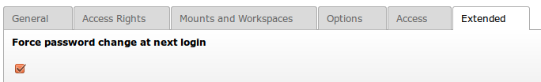

.. ==================================================
.. FOR YOUR INFORMATION
.. --------------------------------------------------
.. -*- coding: utf-8 -*- with BOM.

.. include:: ../Includes.txt

.. _admin-manual:

Administrator Manual
====================

Force password change at next login
-----------------------------------

An administrator can force a backend user to reset his password at next login.

**How to:**

* Edit the backend user from System -> Backend users.
* In "Extended" tab, check the option "Force password change at next login"
* Save

**Screenshot**

