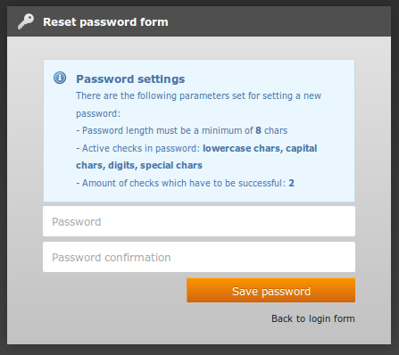

.. ==================================================
.. FOR YOUR INFORMATION
.. --------------------------------------------------
.. -*- coding: utf-8 -*- with BOM.

.. include:: ../Includes.txt

.. _installation:

Installation
============

Web server
^^^^^^^^^^
Web server must accept the sessions. (by default done by all servers)

TYPO3 configuration
^^^^^^^^^^^^^^^^^^^
TYPO3 must be able to send emails. 
Please check your configuration in Install Tool.

Suggested extensions
^^^^^^^^^^^^^^^^^^^^

Make BE user password really secure
...................................

**Extension key**: (`be_secure_pw <http://typo3.org/extensions/repository/view/be_secure_pw>`_)

This extension is fully supported.
All checks are done at password change and a notice information is added 
when user want to change his password.

