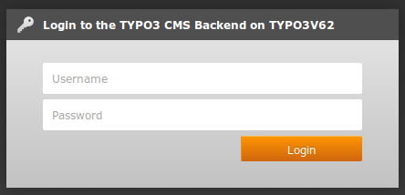
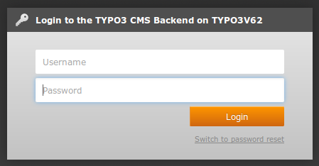
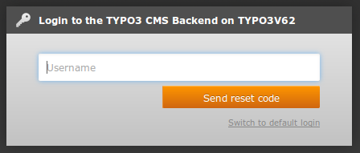
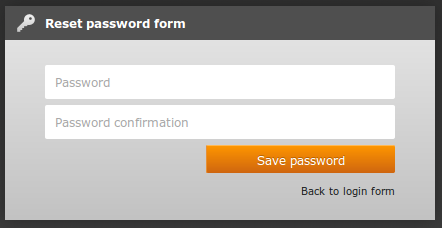

.. ==================================================
.. FOR YOUR INFORMATION
.. --------------------------------------------------
.. -*- coding: utf-8 -*- with BOM.

.. include:: ../Includes.txt

What does it do?
================

This extension allow backend user to ask for a password reset. The administrators can also force an user to change his password at next login.

Screenshots
----------------

Standard Login Form
................

	The standard login form without "password reset" loaded

Modified Login Form
................

	The modified login form with "password reset" loaded

Send Reset Password Form
................

	The form used to send a password reset to user.

Password Reset Form
................

	The form used to set a new password for user.

